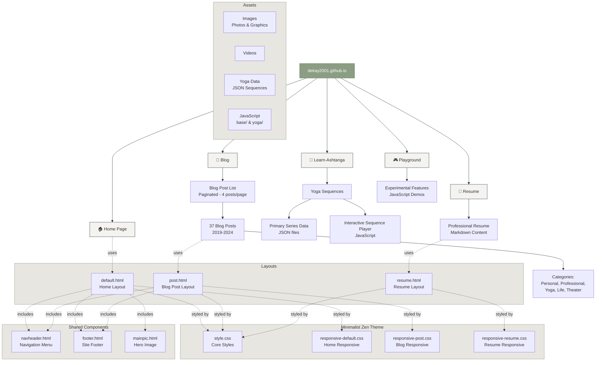

# Website Structure Diagram

This diagram shows the architecture and organization of dekay2001.github.io.



## Site Overview

### Main Pages

| Page | Path | Purpose |
|------|------|---------|
| **Home** | `/` | Welcome page with hero image and main text overlay |
| **Blog** | `/blog/` | Paginated blog posts (4 per page) with 37+ entries from 2019-2024 |
| **Learn-Ashtanga** | `/yoga/` | Interactive yoga sequences with JSON data and JavaScript player |
| **Resume** | `/resume/` | Professional background and experience |
| **Playground** | `/playground/` | Experimental features and JavaScript demos |

### Theme Architecture

**Minimalist Zen Theme** features:
- Warm cream background (#F5F3EF)
- Deep charcoal text (#2C3E50)
- Sage green accents (#8B9D83)
- Modern typography: Playfair Display (headings) + Inter (body)
- Card-based layouts with subtle shadows
- Responsive design optimized for mobile, tablet, and desktop

### File Structure

```
├── _config.yml                 # Jekyll configuration
├── _layouts/                   # Page templates
│   ├── default.html           # Home page layout
│   ├── post.html              # Blog post layout
│   └── resume.html            # Resume layout
├── _includes/                  # Reusable components
│   ├── navheader.html         # Navigation menu
│   ├── footer.html            # Site footer
│   └── mainpic.html           # Hero image
├── _posts/                     # Blog posts (37 files)
├── _data/                      # Site data
│   └── navigation.yml         # Menu structure
├── assets/
│   ├── css/                   # Stylesheets
│   │   ├── style.css          # Core theme styles
│   │   ├── responsive-default.css
│   │   ├── responsive-post.css
│   │   └── responsive-resume.css
│   ├── js/                    # JavaScript
│   │   ├── base/              # Core functionality
│   │   └── yoga/              # Yoga sequence player
│   ├── data/yoga/             # Yoga sequence JSON
│   └── images/                # Site images
└── test/unit/                 # Jest tests
```

### Technology Stack

- **Static Site Generator:** Jekyll (GitHub Pages)
- **Templating:** Liquid
- **Styling:** CSS3 with custom properties (variables)
- **JavaScript:** ES6+ with Babel transpilation
- **Testing:** Jest with jsdom environment
- **Deployment:** GitHub Pages (automatic on push to master)
- **Local Development:** http://localhost:4000

### Blog Post Categories

Posts span topics including:
- Personal reflections
- Professional/software development
- Yoga and philosophy (Eight Limbs series)
- Life experiences
- Theater and arts
- Music and inspiration

---

*Last Updated: November 27, 2025*
