# Website Structure Diagram

This diagram shows the architecture and organization of dekay2001.github.io.

```mermaid
graph TB
    Start[dekay2001.github.io]
    
    %% Main Navigation
    Start --> Home[🏠 Home Page]
    Start --> Blog[📝 Blog]
    Start --> Yoga[🧘 Learn-Ashtanga]
    Start --> Resume[💼 Resume]
    Start --> Playground[🎮 Playground]
    
    %% Blog Structure
    Blog --> BlogList[Blog Post List<br/>Paginated - 4 posts/page]
    BlogList --> Post1[37 Blog Posts<br/>2019-2024]
    Post1 --> Categories[Categories:<br/>Personal, Professional,<br/>Yoga, Life, Theater]
    
    %% Yoga Section
    Yoga --> YogaSeq[Yoga Sequences]
    YogaSeq --> PrimaryData[Primary Series Data<br/>JSON files]
    YogaSeq --> PlaySeq[Interactive Sequence Player<br/>JavaScript]
    
    %% Resume Section
    Resume --> ResumeContent[Professional Resume<br/>Markdown Content]
    
    %% Playground Section
    Playground --> PlaygroundJS[Experimental Features<br/>JavaScript Demos]
    
    %% Layouts
    subgraph Layouts
        DefaultLayout[default.html<br/>Home Layout]
        PostLayout[post.html<br/>Blog Post Layout]
        ResumeLayout[resume.html<br/>Resume Layout]
    end
    
    Home -.uses.-> DefaultLayout
    Post1 -.uses.-> PostLayout
    ResumeContent -.uses.-> ResumeLayout
    
    %% Styling
    subgraph Styling[Minimalist Zen Theme]
        MainCSS[style.css<br/>Core Styles]
        RespDefault[responsive-default.css<br/>Home Responsive]
        RespPost[responsive-post.css<br/>Blog Responsive]
        RespResume[responsive-resume.css<br/>Resume Responsive]
    end
    
    DefaultLayout -.styled by.-> MainCSS
    DefaultLayout -.styled by.-> RespDefault
    PostLayout -.styled by.-> MainCSS
    PostLayout -.styled by.-> RespPost
    ResumeLayout -.styled by.-> MainCSS
    ResumeLayout -.styled by.-> RespResume
    
    %% Components
    subgraph Components[Shared Components]
        NavHeader[navheader.html<br/>Navigation Menu]
        Footer[footer.html<br/>Site Footer]
        MainPic[mainpic.html<br/>Hero Image]
    end
    
    DefaultLayout -.includes.-> NavHeader
    DefaultLayout -.includes.-> Footer
    DefaultLayout -.includes.-> MainPic
    PostLayout -.includes.-> NavHeader
    PostLayout -.includes.-> Footer
    
    %% Data & Assets
    subgraph Assets
        Images[Images<br/>Photos & Graphics]
        Videos[Videos]
        YogaData[Yoga Data<br/>JSON Sequences]
        JSFiles[JavaScript<br/>base/ & yoga/]
    end
    
    style Start fill:#8B9D83,stroke:#6B7D63,color:#fff
    style Blog fill:#F5F3EF,stroke:#2C3E50
    style Yoga fill:#F5F3EF,stroke:#2C3E50
    style Resume fill:#F5F3EF,stroke:#2C3E50
    style Playground fill:#F5F3EF,stroke:#2C3E50
    style Home fill:#F5F3EF,stroke:#2C3E50
    style Styling fill:#E8E6E1,stroke:#8B9D83
    style Layouts fill:#E8E6E1,stroke:#8B9D83
    style Components fill:#E8E6E1,stroke:#8B9D83
    style Assets fill:#E8E6E1,stroke:#8B9D83
```



## Site Overview

### Main Pages

| Page | Path | Purpose |
|------|------|---------|
| **Home** | `/` | Welcome page with hero image and main text overlay |
| **Blog** | `/blog/` | Paginated blog posts (4 per page) with 37+ entries from 2019-2024 |
| **Learn-Ashtanga** | `/yoga/` | Interactive yoga sequences with JSON data and JavaScript player |
| **Resume** | `/resume/` | Professional background and experience |
| **Playground** | `/playground/` | Experimental features and JavaScript demos |

### Theme Architecture

**Minimalist Zen Theme** features:
- Warm cream background (#F5F3EF)
- Deep charcoal text (#2C3E50)
- Sage green accents (#8B9D83)
- Modern typography: Playfair Display (headings) + Inter (body)
- Card-based layouts with subtle shadows
- Responsive design optimized for mobile, tablet, and desktop

### File Structure

```
├── _config.yml                 # Jekyll configuration
├── _layouts/                   # Page templates
│   ├── default.html           # Home page layout
│   ├── post.html              # Blog post layout
│   └── resume.html            # Resume layout
├── _includes/                  # Reusable components
│   ├── navheader.html         # Navigation menu
│   ├── footer.html            # Site footer
│   └── mainpic.html           # Hero image
├── _posts/                     # Blog posts (37 files)
├── _data/                      # Site data
│   └── navigation.yml         # Menu structure
├── assets/
│   ├── css/                   # Stylesheets
│   │   ├── style.css          # Core theme styles
│   │   ├── responsive-default.css
│   │   ├── responsive-post.css
│   │   └── responsive-resume.css
│   ├── js/                    # JavaScript
│   │   ├── base/              # Core functionality
│   │   └── yoga/              # Yoga sequence player
│   ├── data/yoga/             # Yoga sequence JSON
│   └── images/                # Site images
└── test/unit/                 # Jest tests
```

### Technology Stack

- **Static Site Generator:** Jekyll (GitHub Pages)
- **Templating:** Liquid
- **Styling:** CSS3 with custom properties (variables)
- **JavaScript:** ES6+ with Babel transpilation
- **Testing:** Jest with jsdom environment
- **Deployment:** GitHub Pages (automatic on push to master)
- **Local Development:** http://localhost:4000

### Blog Post Categories

Posts span topics including:
- Personal reflections
- Professional/software development
- Yoga and philosophy (Eight Limbs series)
- Life experiences
- Theater and arts
- Music and inspiration

---

*Last Updated: November 27, 2025*
